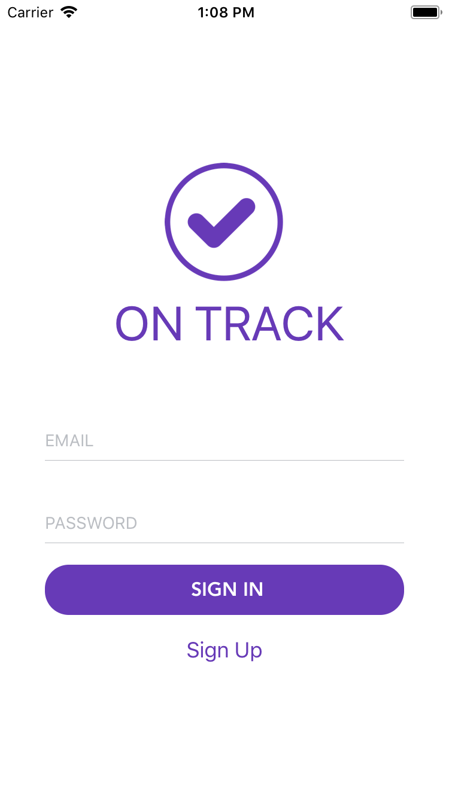

## On Track App





To run your app on iOS:
   react-native run-ios
   - or -
   Open ios/OnTrackApp.xcworkspace in Xcode
   Hit the Run button
To run your app on Android:
   Have an Android emulator running (quickest way to get started), or a device connected
   react-native run-android

### Dependables:
```
brew install watchman
npm install rnpm -g
npm install -g react-native-cli
sudo gem install cocoapods
```

### Install:
```
npm i
cd ios && pod install && cd ..
react-native link
cd app && touch settings.json
```